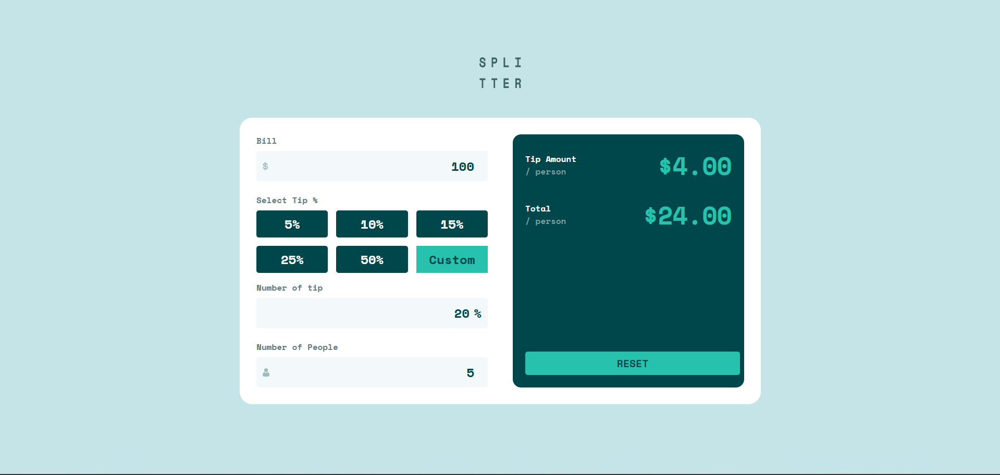

# Frontend Mentor - Tip calculator app solution

This is a solution to the [Tip calculator app challenge on Frontend Mentor](https://www.frontendmentor.io/challenges/tip-calculator-app-ugJNGbJUX). Frontend Mentor challenges help you improve your coding skills by building realistic projects.

## Table of contents

- [Frontend Mentor - Tip calculator app solution](#frontend-mentor---tip-calculator-app-solution)
  - [Table of contents](#table-of-contents)
  - [Overview](#overview)
    - [The challenge](#the-challenge)
    - [Screenshot](#screenshot)
    - [Links](#links)
  - [My process](#my-process)
    - [Built with](#built-with)
    - [What I learned](#what-i-learned)
    - [Continued development](#continued-development)
    - [AI Collaboration](#ai-collaboration)
  - [Author](#author)

**Note: Delete this note and update the table of contents based on what sections you keep.**

## Overview

### The challenge

Users should be able to:

- View the optimal layout for the app depending on their device's screen size
- See hover states for all interactive elements on the page
- Calculate the correct tip and total cost of the bill per person

### Screenshot

### Links

- Solution URL: [Add solution URL here](https://your-solution-url.com)
- Live Site URL: [Add live site URL here](https://your-live-site-url.com)

## My process

### Built with

- Semantic HTML5 markup
- Flexbox
- CSS Grid
- Mobile-first workflow
- Web Component
- Sass

### What I learned

- i learn that in order to update whenever any of input field, button change i need to call `calculate()` function.
- I learn that after ui and algorithm working properly, it must be refactored. The code looks like spaghetti code when not refactored. i can't easily implement change without changing the other part and not breaking stuff
- i learn to use `display: contents` on custom element to make it look disappear in DOM, making the children the next element
- i learn to decide when to use `observedAttributes` by inspecting if inside `innerHTML` use `customButton` variable then `observedAttributes` needed to make sure classes added in right place. if `observedAttributes` not set, it will add the class in web component. for example `<button-custom class="button--active"></button-custom>` button active should be in the `button` element
- i learn that before start coding in javascript i need to write the step by step to have idea what code to write. it also help to break down requirement into manageable tasks
- i learn that `setTimeout(() => tipInput.focus(), 0);` setTimeout will run after DOM Content loaded. even if time set to 0 it will make sure to run after everything loaded
- I learn that input value that get parsed can be NaN. it need to be checked with `isNaN` function
- I learn that the code previously so messy that i don't want to change anything. I force myself to refactor it, making the code follow Single Responsibility Principle and DRY principle. Adter refactor it the code looks fine to implement change. The code on `_calculator.scss` goes from around 350 line into 70 line now
- I learn to create a branch for refactor. In case refactor break and no longer able to fix, i can checkout to main branch
- I start to appreciate frontend framework such as React or Vue because without it i need to create a web component manually, tracking changes on input or variable manually. In web component there are no syntax highlighting inside html tag

### Continued development

There are lot of thing i haven't use in javascript such as writing class, doing inheritance. I want to explore more and practice javascript feature on project
I also not find how to set the border to red when focus in invalid state. The project currently not friendly on accessibility. i want to learn accessibility further

### AI Collaboration

I use deepseek to ask question when i get stuck. it's easy to integrate in vscode chat. For vscode copilot model currently there is only auto.

## Author

- Frontend Mentor - [@Odiesta](https://www.frontendmentor.io/profile/Odiesta)
- X - [@OdiestaS](https://www.x.com/OdiestaS)
